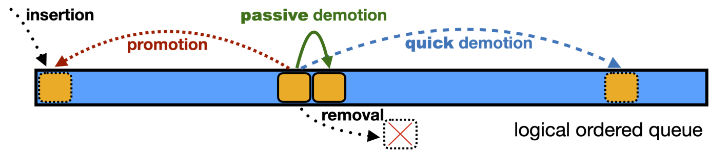

# FIFO can be Better than LRU: the Power of Lazy Promotion and Quick Demotion
This repo contains code for HotOS'23 paper: [FIFO can be Better than LRU: the Power of Lazy Promotion and Quick Demotion](https://junchengyang.com/publications/HotOS23-qdlp.pdf)




### Abstract
LRU has been the basis of cache eviction algorithms for decades, with a plethora of innovations on improving LRU’s miss ratio and throughput. While it is well-known that FIFO- based eviction algorithms provide significantly better throughput and scalability, they lag behind LRU on miss ratio, thus, space efficiency. 

We performed a large-scale simulation study using 6587 block and web cache workloads collected in the past two decades. We find that contrary to what common wisdom sug- gests, some FIFO-based algorithms, such as FIFO-Reinsertion (or CLOCK), are, in fact, more efficient than LRU. Moreover, we find that qick demotion — evicting most new objects very quickly — is critical for space efficiency. We show that when enhanced by qick demotion, not only can state-of-the-art algorithms be more efficient, a simple FIFO-based algorithm can outperform five complex state-of-the-art in terms of miss ratio. 


### Repo structure 
The repo is a snapshot of [libCacheSim](https://github.com/1a1a11a/libCacheSim) which contains the implementation of the algorithms compared in the paper. 


### How to use libCacheSim
You can compile libCacheSim which will provide a `cachesim` util, then you can run simulations with
```bash
# ./cachesim DATAPATH TRACE_FORMAT EVICTION_ALGO CACHE_SIZE [OPTION...]
./cachesim DATA oracleGeneral lru,arc,lecar,qdlp 0 --ignore-obj-size 1
```
Detailed instructions can be found at [libCacheSim](https://github.com/1a1a11a/libCacheSim).


### Traces
The traces we used will be released soon

The traces are [zstd](https://github.com/facebook/zstd) compressed and have the following format:
```c
struct {
    uint32_t timestamp;
    uint64_t obj_id;
    uint32_t obj_size;
    int64_t next_access_vtime;  // -1 if no next access
}
```
The compressed traces can be used with libCacheSim without decompression.


### License
```
Copyright 2023, Carnegie Mellon University

Licensed under the Apache License, Version 2.0 (the "License");
you may not use this file except in compliance with the License.
You may obtain a copy of the License at

    http://www.apache.org/licenses/LICENSE-2.0

Unless required by applicable law or agreed to in writing, software
distributed under the License is distributed on an "AS IS" BASIS,
WITHOUT WARRANTIES OR CONDITIONS OF ANY KIND, either express or implied.
See the License for the specific language governing permissions and
limitations under the License.
```

### Acknowledgement
We greatly thank the following people and organizations that made this work possible. 
#### Testbed
We greatly appreciate the resources and support provided by [Cloudlab](https://cloudlab.us) for performing the large-scale evaluations. 
<!-- Especially Leigh and Mike for helping with many aspects of using the testbed. -->

#### Open source cache traces and **the people behind it**
* [Twitter](https://github.com/twitter/cache-traces)
* [Tencent Block](https://www.usenix.org/conference/atc20/presentation/zhang-yu) ([Download](http://iotta.snia.org/traces/parallel?only=27917))
* [Tencent Photo](https://dl.acm.org/doi/10.1145/3205289.3205299) ([Download](http://iotta.snia.org/traces/parallel?only=27476))
* [Wikimedia CDN](https://wikitech.wikimedia.org/wiki/Analytics/Data_Lake/Traffic/Caching)
* [Alibaba Block](https://github.com/alibaba/block-traces)
* [MSR](http://iotta.snia.org/traces/block-io?only=388)
* [FIU](http://iotta.snia.org/traces/block-io?only=390)
* [CloudPhysics](https://www.usenix.org/conference/fast15/technical-sessions/presentation/waldspurger)

#### Funding
[Meta Fellowship](https://research.facebook.com/blog/2020/1/announcing-the-recipients-of-the-2020-facebook-fellowship-awards/)

This work was supported in part by Facebook Fellowship, NSF grants CNS 1901410 and 1956271, and a AWS grant. 


### Citation
```bibtex
@inproceedings{yang2023qd,
  title={FIFO can be Better than LRU: the Power of Lazy Promotion and Quick Demotion},
  author={Yang, Juncheng and Qiu, Ziyue and Zhang, Yazhuo and Yue, Yao and Rashmi, K.V.},
  booktitle={The 19th Workshop on Hot Topics in Operating Systems (HotOS 23)},
  year={2023}
}
``` 


